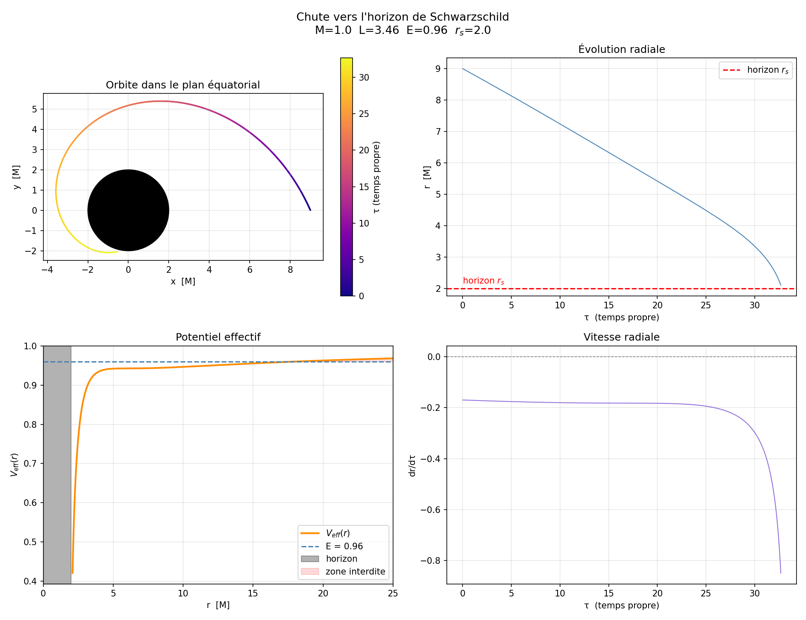

# Schwarzschild Geodesics Simulator

This project is a high-performance numerical simulator for particle trajectories (geodesics) around a non-rotating black hole using the **Schwarzschild metric**. 

This tool bridges the gap between theoretical General Relativity and computational physics.

*Typical output showing the effective potential, radial velocity, and the trajectory of a captured particle.*

---

## The Black Hole Trilogy

This project is the last chapter of a three-part series, going from the physics of a single trajectory to a full animated render:

| # | Project | What it does |
| :-- | :-- | :-- |
| 1 | **`schwarzschild_effective_potential`** (this repository) | Integrates the fall of a massive particle in the Schwarzschild metric (effective potential, RK4) and plots its orbit. |
| 2 | [`blackhole_tracer`](https://github.com/NathanCor/blackhole_tracer) | Ray tracer producing a still image of a black hole and its accretion disk from a fixed viewpoint, with a benchmark against the exact null geodesics. |
| 3 | [`blackhole_tracer_3d`](https://github.com/NathanCor/blackhole_tracer_3d) | Animated version: the camera orbits the black hole, and the disk rotates in a seamless loop. |

---

## 🌌 Physics Overview

The simulation integrates the equations of motion derived from the **Schwarzschild vacuum solution**. By exploiting the symmetries of the spacetime, we define the **Effective Potential** $V_{\text{eff}}$ for a massive test particle:

$$V_{\text{eff}}(r) = -\frac{M}{r} + \frac{L^2}{2r^2} - \frac{ML^2}{r^3}$$

The term $-\frac{ML^2}{r^3}$ is the **Relativistic Correction**. Unlike Newtonian gravity, this term is responsible for:
* **Inspirals & Capture:** Particles crossing the Innermost Stable Circular Orbit (ISCO).
* **Perihelion Precession:** The relativistic shift of orbital ellipses.
* **Photon Sphere:** Unstable circular orbits for light at $r = 3M$.

## 🛠️ Technical Stack

* **Solver (C++):** A standalone engine implementing the **4th-order Runge-Kutta (RK4)** method.
* **Visualization (Python):** A suite using `Matplotlib` and `NumPy` to generate professional-grade plots.
* **Units:** The simulator operates in **Geometric Units** ($G = c = M = 1$).

## 📂 Project Structure

* `src/`: C++ source files (`main.cpp`, `rk4.cpp`, `schwarzschild.cpp`).
* `scripts/`: Python scripts for data processing and plotting (`plot.py`).
* `docs/`: **Mathematical derivations** and theoretical notes.
* `assets/`: Simulation plots and visual assets.
* `Makefile`: Automated build system.

## 🚀 Getting Started & Usage

### Prerequisites
* A C++ compiler (e.g., GCC, Clang).
* Python 3.x with `matplotlib`, `numpy`, and `pandas`.

### Commands
The project is fully automated via the `Makefile`. You can use the following commands:

| Command | Description |
| :--- | :--- |
| `make` | **Full Pipeline**: Compiles the code, runs the simulation, and generates the plots. |
| `make build` | **Compilation only**: Generates the `solver` binary. |
| `make run` | **Simulation only**: Runs the solver and generates `trajectory.csv`. |
| `make plot` | **Visualization only**: Runs the Python script to display the results. |
| `make clean` | **Cleanup**: Removes the binary and the generated CSV data. |

## 📝 Theoretical Derivations
Detailed handwritten derivations of the geodesic equations from the Schwarzschild metric can be found in the `docs/` folder.

## 📚 Academic References
* *A First Course in General Relativity*, Bernard Schutz.
* *An Introduction to Modern Astrophysics*, Carroll & Ostlie.
* *Relativité Générale pour débutants*, Michel Le Bellac.

---
*Developed with passion for Astrophysics and Physics Research.*
